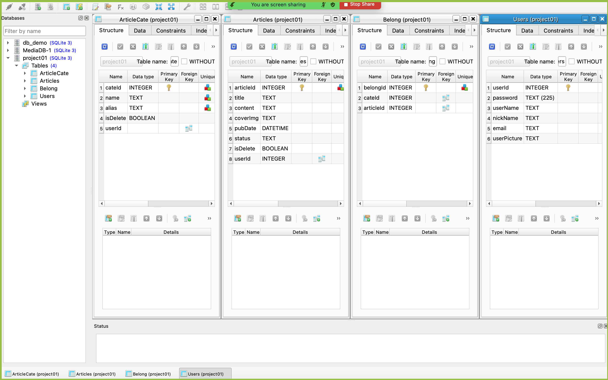
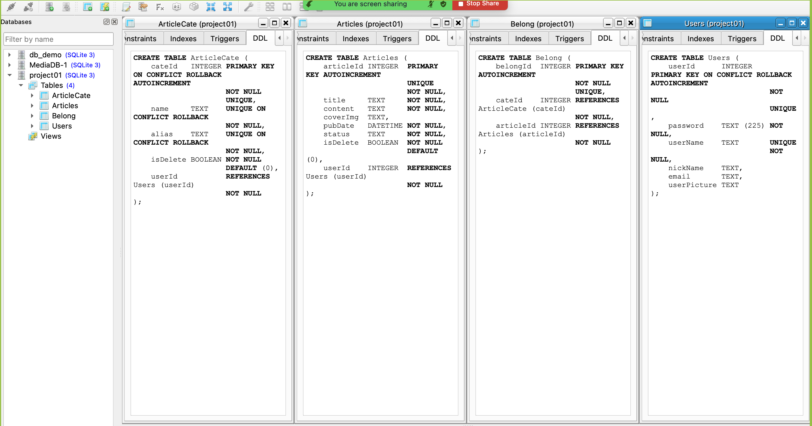
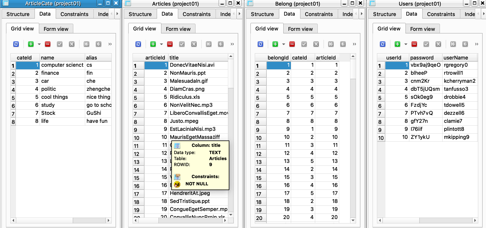
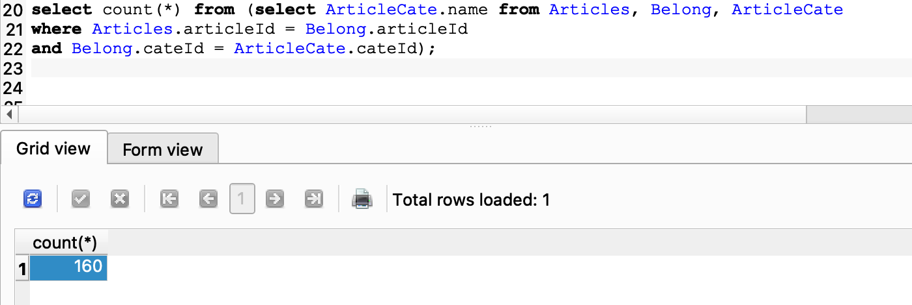
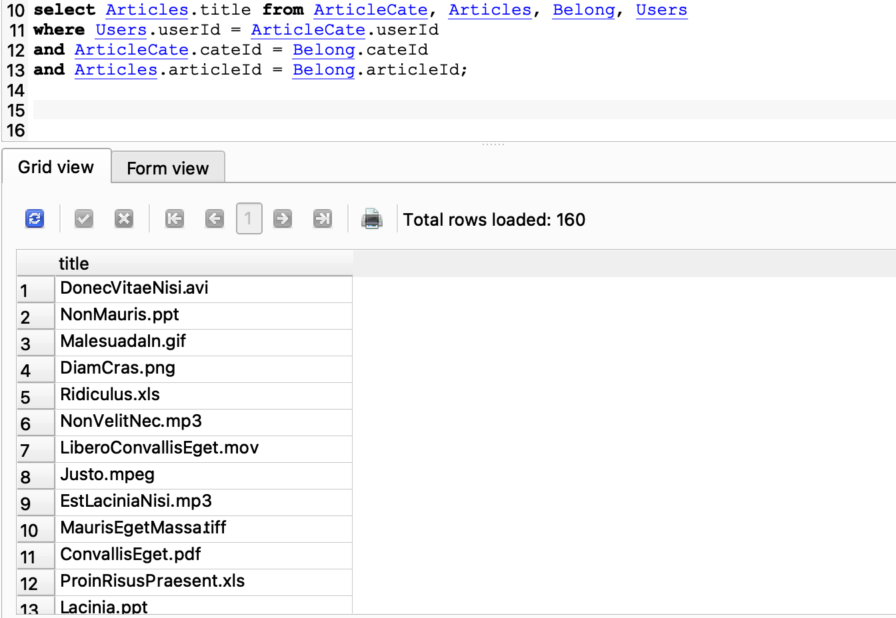
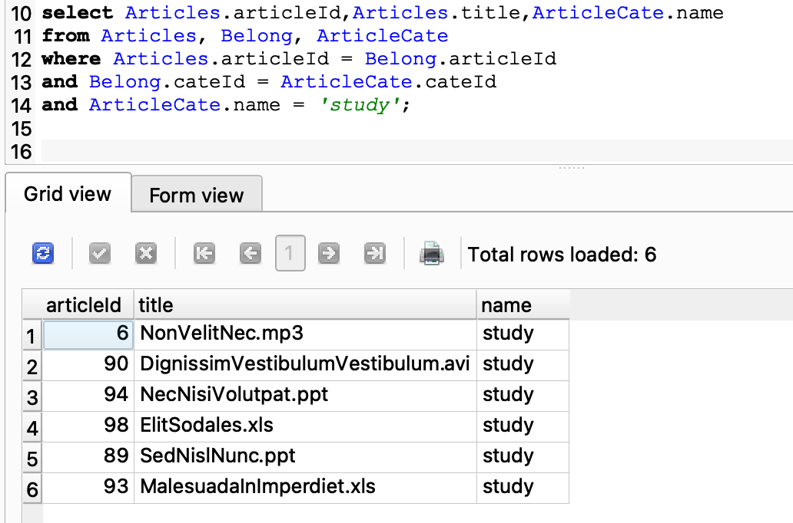
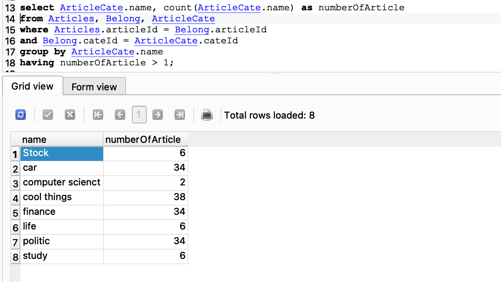
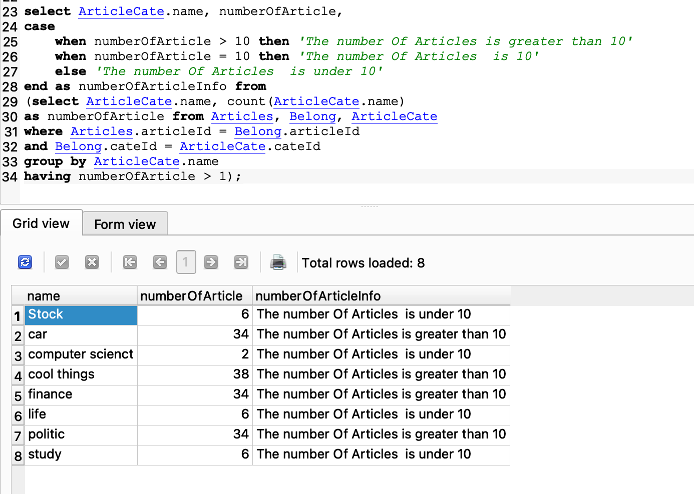

# Article management system

Jinxin Hu:
	Completed the sign-up and log-in part;
	Wrote the code of article category, article list and article deleting parts;
	Wrote code of back-end part of posting articles;

Wenrui Fang:
	Wrote the page of homepage part;
	Completed other auxiliary functions like getting user basic information and updating password;
	Wrote code of front-end part of posting articles;
	
The diagram on the homepage is not the content of this project. It is just a sample display.

## User Story

David wants to have a platform where he can record and publish his thoughts. He can record the knowledge he learns in his life, the news he hears about and his views on these things in this article management system. The article management system needs to have the function of classification retrieval. David can also add new categories he wants so that he can choose to publish the article to the appropriate category.

## Business Requirements

Users can register a new account.

The user should log in to the account.

Users can add the article category they want to publish.

Users can post articles.

Users can view their basic information.

The user can set up and change the profile photo.

Users can reset their own password.

Article needs to have an author

Articles need to have at least one classification

Article needs to have a title

The article needs to have a body

Articles can be published

The article can have a cover image

The article category needs to have an alias

**Nouns**: Users , Articles,  Article Category

**Verbs**: record, publish

**Attribs**: Users(username, password, nickname, email, profile photo), Article Category(name, alias), Articles(title, content, cover image, publication date, status)

## Conceptual Model(UML)


## Logical Data Model

### ER Diagram

https://www.edrawmax.cn/online/share.html?code=b80d0af6362911ec90b29d87e1af6f2f


### Relational Schema

Users (**<u>userId</u>**, userName, nickName, email, userPicture);

ArticleCate (**<u>cateId</u>**, name, alias, isDelete, <u>userId</u>)

Articles (**<u>articleId</u>**, title, content, coverImg, pubDate, status, isDelete, <u>userId</u>, <u>cateId</u>)

Belong (**<u>belongId</u>**, <u>cateId</u>, <u>articleId</u>)

(Notes: PK = **<u>PK</u>**; FK = <u>FK</u>)

### BCNF Proof

Each column of our database table is an indivisible basic data item, so it satisfies the first paradigm of BCNF.

There is no partial functional dependence of non-key fields on any candidate key in the database table, that is, all non-key fields are completely dependent on any set of candidate keys.

(userId) -> (userName, password, nickName, email, userPicture)

(cateId) -> (name, alias,isDelete. (FK) userId: NUMBER)

(articleId) -> (title, content, coverImg, pubDate, status, isDelete, (FK) userId)

In our data table, there is no transfer function dependence of non-key fields on any candidate key field, which conforms to the third normal form.

Within the scope of functional dependency, our data table has been completely separated, and the exception of insertion and deletion has been eliminated.


## Physical Model

### Create database with SQLite

```sqlite
--This table is for article category.
CREATE TABLE ArticleCate (
cateId INTEGER PRIMARY KEY ON CONFLICT ROLLBACK AUTOINCREMENT
NOT NULL
UNIQUE,
name TEXT UNIQUE ON CONFLICT ROLLBACK
NOT NULL,
alias TEXT UNIQUE ON CONFLICT ROLLBACK
NOT NULL,
isDelete BOOLEAN NOT NULL
DEFAULT (0),
userId REFERENCES Users (userId)
NOT NULL
);

--This table is for saving articles detail information.
CREATE TABLE Articles (
articleId INTEGER PRIMARY KEY AUTOINCREMENT
UNIQUE
NOT NULL,
title TEXT NOT NULL,
content TEXT NOT NULL,
coverImg TEXT,
pubDate DATETIME NOT NULL,
status TEXT NOT NULL,
isDelete BOOLEAN NOT NULL
DEFAULT (0),
userId INTEGER REFERENCES Users (userId)
NOT NULL
);

--This table is connecting Articles table and ArticleCate table which is many to many relationship.
CREATE TABLE Belong (
belongId INTEGER PRIMARY KEY AUTOINCREMENT
NOT NULL
UNIQUE,
cateId INTEGER REFERENCES ArticleCate (cateId)
NOT NULL,
articleId INTEGER REFERENCES Articles (articleId)
NOT NULL
);

--This table is for saving user information.
CREATE TABLE Users (
userId INTEGER PRIMARY KEY ON CONFLICT ROLLBACK AUTOINCREMENT
NOT NULL
UNIQUE,
password TEXT (225) NOT NULL,
userName TEXT UNIQUE
NOT NULL,
nickName TEXT,
email TEXT,
userPicture TEXT
);

```

### Successful create table



### Import data into database

### Testing table is work

```sqlite
--Check all articles in database.
select Articles.title from ArticleCate, Articles, Belong, Users
where Users.userId = ArticleCate.userId
and ArticleCate.cateId = Belong.cateId
and Articles.articleId = Belong.articleId;

--Select Articles which belong to study category.
select Articles.articleId,Articles.title,ArticleCate.name 
from Articles, Belong, ArticleCate
where Articles.articleId = Belong.articleId
and Belong.cateId = ArticleCate.cateId
and ArticleCate.name = 'study';

--Find out total number of articles and category name of each category.
select ArticleCate.name, count(ArticleCate.name) as numberOfArticle 
from Articles, Belong, ArticleCate
where Articles.articleId = Belong.articleId
and Belong.cateId = ArticleCate.cateId
group by ArticleCate.name
having numberOfArticle > 1;

--Find total of articles.
select count(*) from (select ArticleCate.name from Articles, Belong, ArticleCate
where Articles.articleId = Belong.articleId
and Belong.cateId = ArticleCate.cateId);

--Find out total number of articles and category name of each category and show information whether the number is greater than 10 or not.
select ArticleCate.name, numberOfArticle,
case 
    when numberOfArticle > 10 then 'The number Of Articles is greater than 10'
    when numberOfArticle = 10 then 'The number Of Articles  is 10'
    else 'The number Of Articles  is under 10'
end as numberOfArticleInfo from 
(select ArticleCate.name, count(ArticleCate.name) 
as numberOfArticle from Articles, Belong, ArticleCate
where Articles.articleId = Belong.articleId
and Belong.cateId = ArticleCate.cateId
group by ArticleCate.name
having numberOfArticle > 1);
```






## How to Start

Download nodejs and install

Download link: https://nodejs.org/dist/v8.9.4/node-v8.9.4-x64.msi

Download main from https://github.com/hujinxinchengdu/Article-management-system

For backend first of all go the backend folder

```
cd backend
```


Open the console and enter commands to install related dependencies

```
npm install
```

Enter the following command in the vscode console:

```
nodemon app.js
```

If do not have nodemon you should install it by following command

```
npm install -g nodemon
```

For Frontend using vscode live sever--run server using login.html

https://www.youtube.com/watch?v=7xchuqcsncY
